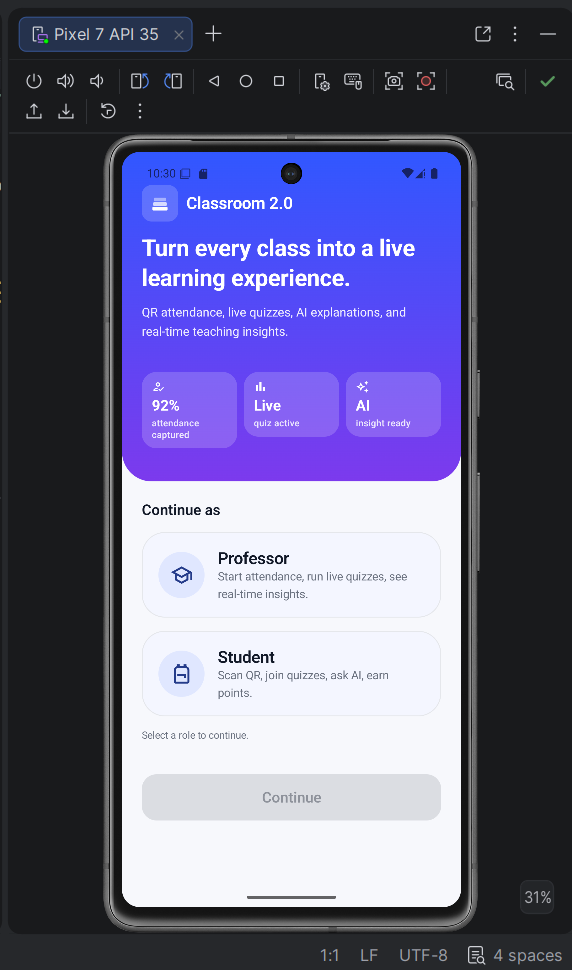
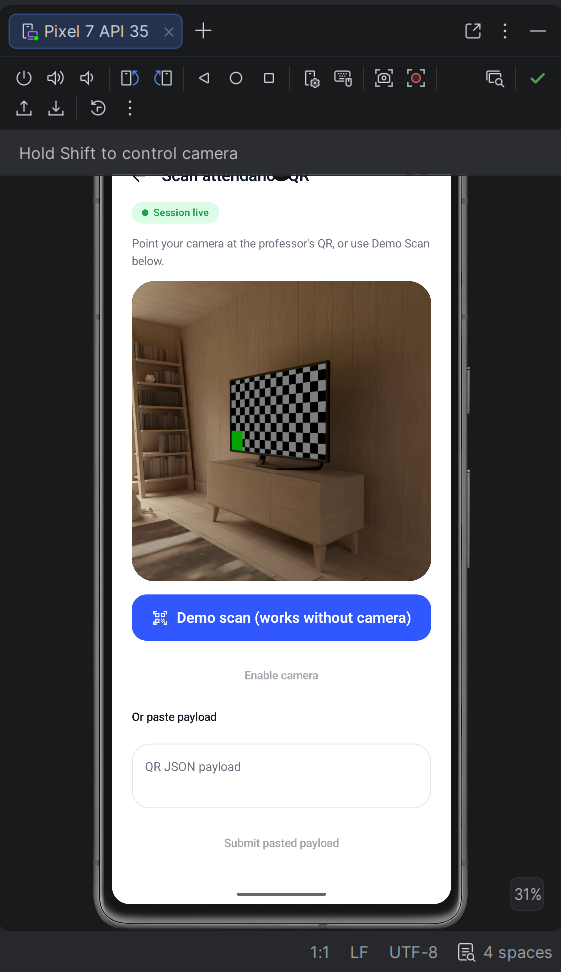
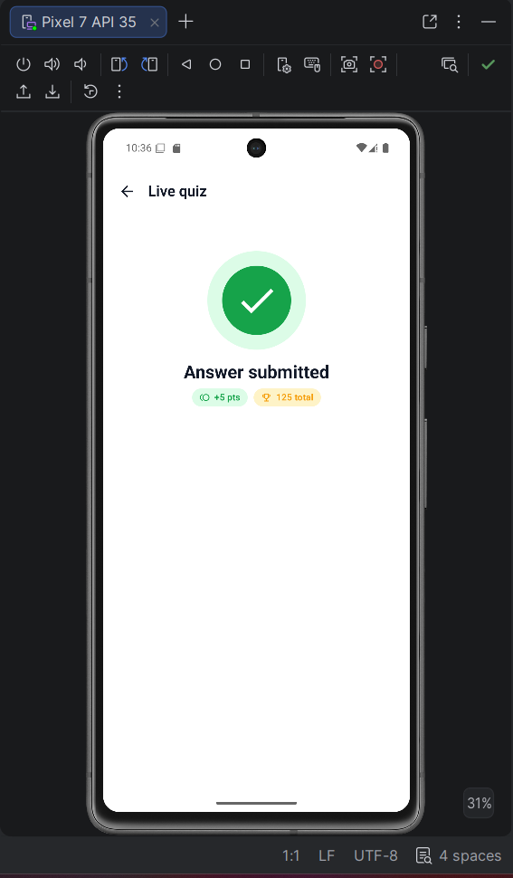
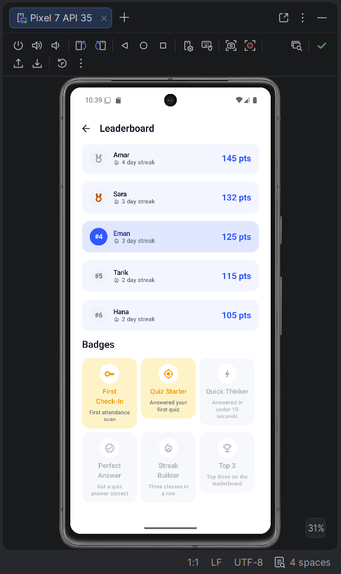
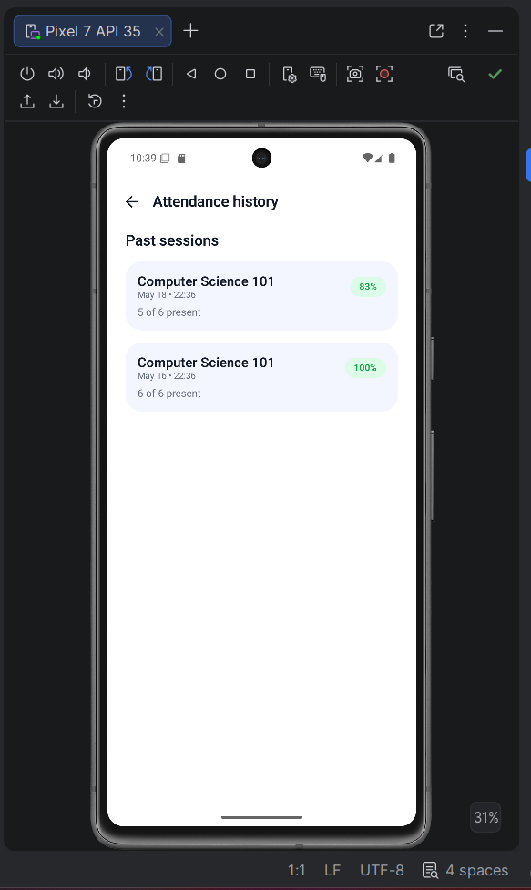

# Classroom 2.0

**Turn every class into a live learning experience.**

A native Android app combining QR attendance, live quizzes, AI-powered concept explanations, real-time teaching insights, and student gamification into one product.

---

## The Problem

Classrooms still rely on manual attendance and passive lectures. Professors don't know who's present or who understood the lesson until it's too late.

- Attendance wastes time.
- Students stay passive.
- Professors lack instant comprehension feedback.
- Learning data is scattered or lost.

## The Solution

Classroom 2.0 is a real-time classroom operating system on Android:

- Professors capture attendance in seconds with a session-specific QR code.
- Students check in with one scan.
- Professors launch live multiple-choice quizzes.
- Students answer instantly; results render as live bar charts.
- The Insight Dashboard turns those answers into a teaching recommendation.
- The AI Concept Explainer helps students understand difficult topics.
- Points, streaks, and badges keep participation high; the leaderboard shows who's leading the class.

---

## Features

### Required

| Feature | What it does |
|---|---|
| **QR Code Digital Attendance** | Session-specific QR with expiration. ZXing generation. CameraX + ML Kit live scanning. Duplicate-check prevention. Live present-count on the professor side. |
| **Live Quiz** | One-shot multiple-choice quiz. Students answer once. Professor sees a live distribution chart with the correct option highlighted. |

### Extras

| Feature | What it does |
|---|---|
| **AI Concept Explainer** | Four structured modes — "Like I'm 12", Example, 3 bullets, Mini quiz. Templated locally; works offline. |
| **Professor Insight Dashboard** | Class-understanding %, participation rate, most-missed answer, AI recommendation, suggested follow-up question. |
| **Gamification + Smart Points** | +10 attendance, +5 streak bonus, +5 participation, +15 correct. Six badges. Live leaderboard with podium card. |
| **Attendance History** | Past sessions with present-count and attendance percentage. |

---

## Why Classroom 2.0 Stands Out

| Judging Area | How We Address It |
|---|---|
| **Required Features** | QR attendance and live quiz are implemented end-to-end with anti-cheating guards (session-specific QR, expiration, one record per student per session/quiz). |
| **Creativity** | AI explanations with four output styles, professor insight dashboard with deterministic recommendation engine, gamification with six badges, podium leaderboard, animated counters. |
| **Technical Quality** | Kotlin 2.0.21, Jetpack Compose, Material 3, MVVM, repository pattern, Firebase Firestore with real-time `callbackFlow` listeners, kotlinx serialization for QR payloads, dual light + dark theme. |
| **UX/UI** | Premium design system with palette, spacing, and shape tokens. Vector icons throughout, no emoji chrome. Gradient hero cards, animated counters, animated result bars, polished empty/loading/error states, neutral product copy. |
| **Completeness** | Seeded leaderboard and session history, every CTA wired, README + Firestore security rules + 2-minute pitch script + QA checklist all shipped. |

---

## Demo Flow

The full classroom loop on a single Android device:

1. Choose **Professor**. Dashboard appears with class summary, live status, and primary actions.
2. **Start attendance** → session-specific QR appears with countdown timer.
3. Tap **Student view** in the top-right to flip to the student dashboard.
4. **Scan attendance QR** → success screen confirms attendance with point and streak breakdown.
5. Back to **Professor view** — present count updates live, student appears in the check-in list.
6. **Start live quiz** → "Use demo question" preloads a polymorphism quiz → **Start quiz**.
7. **Student view** → quiz auto-appears → pick the correct option → submit.
8. **Professor view** → results bar chart animates, correct option highlighted in green.
9. **View insight** → class-understanding %, recommended next step, suggested follow-up question.
10. **Leaderboard** → ranked class with current student highlighted, podium for top three, badges earned.
11. **AI explainer** → type any concept, choose a style, generate a structured explanation.

---

## Screenshots



| Professor Dashboard | Student Dashboard | QR Attendance |
|---|---|---|
|  |  |  |

| Student Scanner | Live Quiz | Quiz Submitted |
|---|---|---|
|  |  |  |

| Quiz Results | Insight Dashboard | AI Explainer |
|---|---|---|
|  |  |  |

| Leaderboard | Badges | Attendance History |
|---|---|---|
|  |  |  |

---

## Tech Stack

- **Language:** Kotlin 2.0.21
- **UI:** Jetpack Compose, Material 3, Navigation Compose
- **Architecture:** MVVM with StateFlow, repository pattern
- **Persistence:** Firebase Firestore with real-time snapshot listeners
- **QR generation:** ZXing
- **QR scanning:** CameraX + ML Kit Barcode
- **Permissions:** Accompanist Permissions
- **Serialization:** kotlinx.serialization

## Architecture

```
com.classroom2.app
├── data
│   ├── remote          FirebaseInitializer, FirestorePaths, ServiceLocator, InMemoryStore
│   └── repository      Attendance, Quiz, Insight, Gamification, Auth
├── domain
│   └── model           User, ClassSession, AttendanceRecord, Quiz, QuizAnswer, InsightSummary, Badge, …
├── presentation
│   ├── onboarding      RoleSelectionScreen
│   ├── professor       ProfessorDashboardScreen
│   ├── student         StudentDashboardScreen
│   ├── attendance      ProfessorAttendanceScreen, StudentScannerScreen, AttendanceSuccessScreen
│   ├── quiz            CreateQuizScreen, StudentQuizScreen, QuizResultsScreen
│   ├── insight         InsightDashboardScreen
│   ├── ai              AIExplainerScreen
│   ├── leaderboard     LeaderboardScreen
│   ├── history         AttendanceHistoryScreen
│   └── components      Reusable Compose primitives
├── ui
│   ├── theme           Classroom2Theme (light + dark), Color, Type, Shape, Spacing
│   ├── navigation      Routes, AppNavGraph
│   └── icons           ClassroomIcons resolver
└── util                QRCodeUtil, TimeUtil, DemoData, AIExplainer, AppResult
```

Every repository is an interface with a Firestore implementation. Reads use `callbackFlow` + `addSnapshotListener` for live updates; writes are suspending via `kotlinx-coroutines-play-services`.

### Firebase Schema

```
users/{userId}
sessions/{sessionId}
sessions/{sessionId}/attendance/{studentId}     ← studentId as doc id = duplicate-checkin guard
quizzes/{quizId}
quizzes/{quizId}/answers/{studentId}            ← studentId as doc id = one-answer guard
leaderboards/demo-class/students/{studentId}
```

`firestore.rules` at the repo root contains the security rules.

---

## How To Run

1. Clone the repository.
2. Open in Android Studio (Hedgehog or newer).
3. Run on an emulator or device (minSdk 24).

## AI Tools Used

Claude (Anthropic) assisted with product strategy review, README polish, and accelerating implementation. The final code is hand-reviewed Kotlin with Jetpack Compose, MVVM, and Firebase Firestore.

## Future Improvements

- LMS integration (Google Classroom, Canvas)
- Push notifications
- Export attendance as CSV / PDF
- Real AI API integration behind the existing `AIExplainer` interface
- Rotating QR every 30s
- Cloud Functions for trusted point updates
- Multi-class roster support

---

## Pitch

Classroom 2.0 replaces passive classrooms with **interactive, measurable, AI-assisted** learning.
