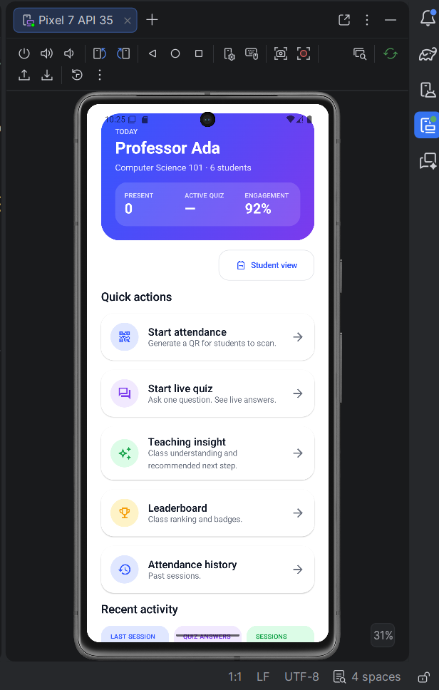
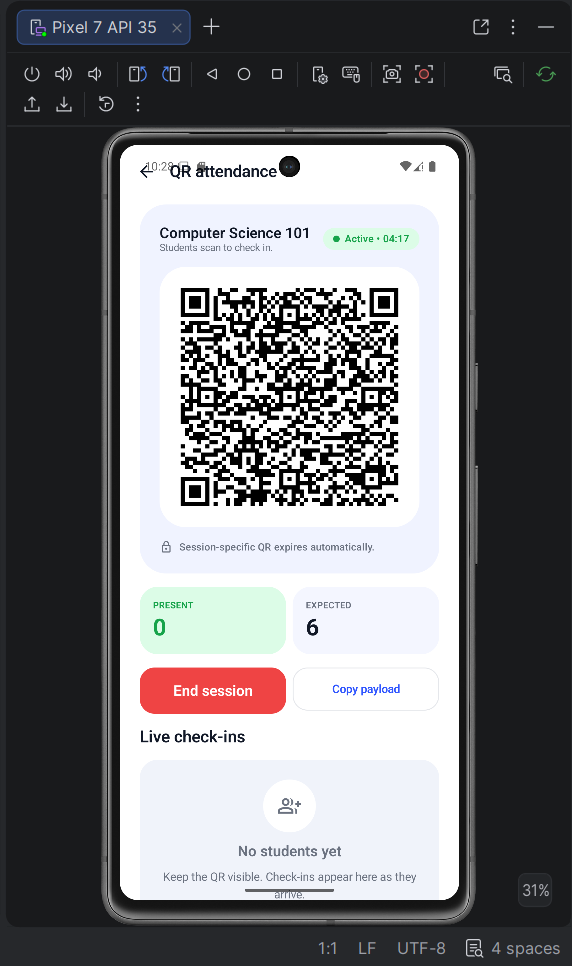
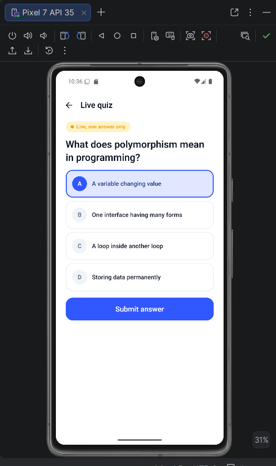
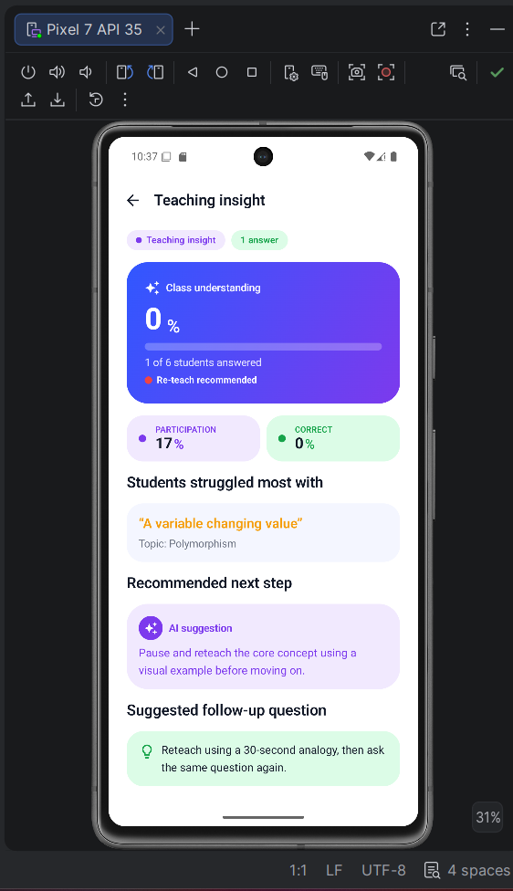
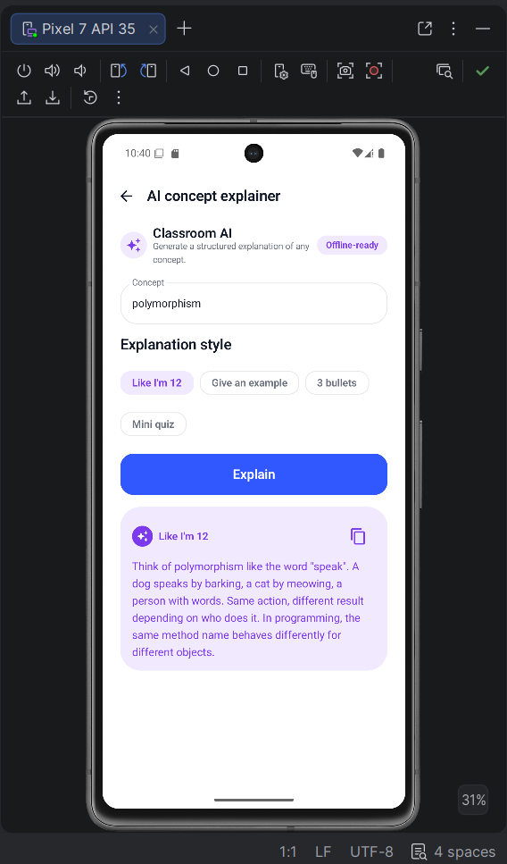
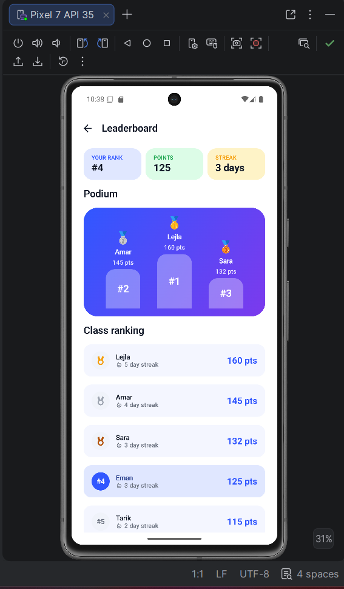
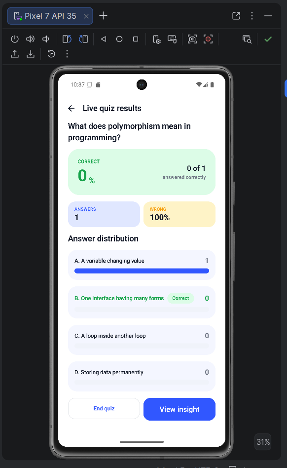
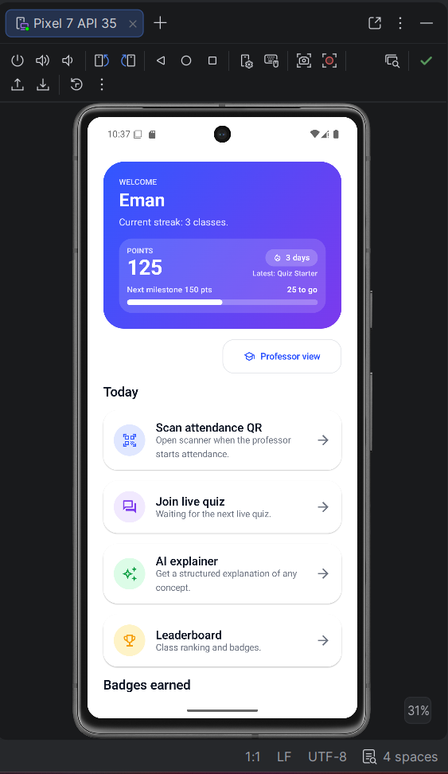

# Classroom 2.0

**Turn every class into a live learning experience.**

A native Android hackathon project that combines QR attendance, live quizzes, AI-powered concept explanations, real-time teaching insights, and student gamification into a single polished experience.

---

## The Problem

Most classrooms still rely on manual attendance and passive lectures. Professors often do not know who is present or whether students understood the lesson until after class is over.

1. Attendance wastes time.
2. Students stay passive.
3. Professors lack instant comprehension feedback.
4. Learning data is scattered or lost.

## The Solution

Classroom 2.0 is a real-time classroom operating system on Android:

- Professors capture attendance in seconds with a session-specific QR.
- Students check in with one scan (or a single tap in Demo Mode).
- Professors launch live multiple-choice quizzes.
- Students answer instantly; results render as live bars.
- The Insight Dashboard turns those answers into a teaching recommendation.
- The AI Concept Explainer helps students understand difficult topics.
- Points, streaks, and badges keep participation high; the leaderboard shows who's leading the class.

---

## Features

### Required

| Feature | What it does |
|---|---|
| **QR Code Digital Attendance** | Session-specific QR with expiration, live present count, ZXing generation, CameraX + ML Kit scanning, Demo Scan + paste-payload fallbacks, duplicate-check prevention. |
| **Live Quiz** | One-shot multiple-choice quiz; students answer once; professor sees a live distribution chart with the correct option highlighted. |

### Winning Extras

| Feature | What it does |
|---|---|
| **AI Concept Explainer** | Four structured modes (Like I'm 12, Example, 3 bullets, Mini quiz) — templated locally so it works offline. Polymorphism gets a demo-tuned response. Copy-to-clipboard on every output. |
| **Professor Insight Dashboard** | Class-understanding %, participation rate, most-missed answer, confusing topic, "AI suggestion" recommendation, follow-up question. Survives the professor ending the quiz. |
| **Gamification & Smart Points** | +10 attendance, +5 streak bonus, +5 participation, +15 correct. Six badges (First Check-In, Quiz Starter, Quick Thinker, Perfect Answer, Streak Builder, Top 3). Live leaderboard with podium card. |

### Bonus

- Attendance history pre-seeded with two past sessions (never empty).
- Role switcher in both dashboards so the entire demo runs on a single device.
- Light + dark theme.
- Demo Mode chip surfaces whenever the app runs without a real Firebase project.

---

## Screenshots

| Professor Dashboard | QR Attendance | Student Success |
|---|---|---|
|  |  |  |

| Live Quiz | Insight Dashboard | AI Explainer |
|---|---|---|
|  |  |  |

| Leaderboard | Quiz Results | Student Dashboard |
|---|---|---|
|  |  |  |

> Drop PNG captures into `screenshots/` using the filenames above — the README will render them automatically.

---

## Why Classroom 2.0 Stands Out

| Judging Area | How We Address It |
|---|---|
| **Required Features** | QR attendance and live quiz are implemented end-to-end with anti-cheating guards (session-specific QR, expiration, one record per student per session/quiz). |
| **Creativity** | AI explanations with four output styles, professor insight dashboard with recommendation engine, gamification with six badges, podium leaderboard, animated counters, Demo Mode that ships zero-config. |
| **Technical Quality** | Kotlin 2.0.21, Jetpack Compose, Material 3, MVVM, repository pattern with dual backend (Firestore + in-memory) behind ServiceLocator, real-time `callbackFlow` listeners, kotlinx serialization for QR payloads. |
| **UX/UI** | Premium design system (palette + spacing + shape tokens + dark scheme), gradient hero cards, animated counters, animated result bars, polished empty/loading/error states, friendly copy. |
| **Completeness** | Demo mode chip + seeded session history + seeded leaderboard, every CTA wired, README + firestore.rules + pitch script + QA checklist all shipped. |

---

## 2-Minute Demo Flow

The app is designed to run the entire flow on **one device**:

1. Choose **Professor** on the gradient onboarding screen.
2. Tap **Start attendance** → QR card with countdown appears, present-count is 0.
3. Top-right → **Student view** to flip to the student dashboard.
4. Tap **Scan attendance QR** → tap **Demo scan (works without camera)**.
5. Animated success screen — "You're checked in!" with +15 points & streak bonus.
6. Top-right → **Pro view**. Present count is now 1, Eman appears in the live list.
7. Tap **Start live quiz** → tap **Use demo question** ("What does polymorphism mean?") → **Start quiz**.
8. Top-right → **Student view**. Quiz auto-appears → pick *One interface having many forms* → **Submit**. "Correct! 🎯 +20 pts".
9. Top-right → **Pro view**. Results bar chart animates, green bar on the correct option.
10. Tap **View insight** → "Class understanding 100%", participation chip, AI recommendation card.
11. From either side: **Leaderboard** → Eman now at the top, badges earned, classmates seeded.
12. **Student view → AI explainer** → "polymorphism" + *Like I'm 12* → templated answer rendered like a chat reply with copy button.

The full 2-minute pitch script lives in `docs/PITCH_SCRIPT.md`.

---

## Tech Stack

- **Language:** Kotlin 2.0.21
- **UI:** Jetpack Compose, Material 3, Navigation Compose
- **Architecture:** MVVM with StateFlow + Repository pattern
- **Persistence:** Firebase Firestore (real-time `callbackFlow` listeners) **or** in-memory StateFlow fallback
- **QR generation:** ZXing
- **QR scanning:** CameraX + ML Kit Barcode + Demo Scan + paste fallback
- **Permissions:** Accompanist Permissions
- **Serialization:** kotlinx.serialization

## Architecture

```
com.classroom2.app
├── data
│   ├── remote          FirebaseInitializer, FirestorePaths, InMemoryStore, ServiceLocator
│   └── repository      Attendance / Quiz / Insight / Gamification / Auth (interface + Firestore + Local impls)
├── domain
│   └── model           User, ClassSession, AttendanceRecord, Quiz, QuizAnswer, InsightSummary, Badge, …
├── presentation
│   ├── onboarding      RoleSelectionScreen
│   ├── professor       ProfessorDashboardScreen
│   ├── student         StudentDashboardScreen
│   ├── attendance      ProfessorAttendanceScreen, StudentScannerScreen, AttendanceSuccessScreen, AttendanceViewModel
│   ├── quiz            CreateQuizScreen, StudentQuizScreen, QuizResultsScreen, QuizViewModel
│   ├── insight         InsightDashboardScreen
│   ├── ai              AIExplainerScreen
│   ├── leaderboard     LeaderboardScreen
│   ├── history         AttendanceHistoryScreen
│   └── components      ClassroomScaffold, GradientHeader, DashboardHeroCard, ActionCard, MetricCard, StatusChip, EmptyStateCard, LoadingCard, AnimatedCounter, BadgePill, DemoModeBanner, ClassroomCard, PrimaryActionButton, OptionCard, LeaderboardRow, BadgeCard, SectionHeader, SuccessCheck
├── ui
│   ├── theme           Classroom2Theme, Color, Type, Shape (ClassroomShapes), Spacing (ClassroomSpacing)
│   └── navigation      Routes, AppNavGraph
└── util                QRCodeUtil (ZXing), TimeUtil, DemoData, AIExplainer, AppResult
```

Every repository is an interface with two implementations:

- `Firestore*Repository` — `addSnapshotListener` wrapped in `callbackFlow` for real-time reads; suspending writes via `kotlinx-coroutines-play-services`.
- `Local*Repository` — `InMemoryStore` MutableStateFlows. Same observer semantics — UI doesn't know which backend it's reading.

`ServiceLocator` picks the impl at runtime based on `FirebaseInitializer.firestoreAvailable`. If `google-services.json` has the placeholder project id `classroom2-demo-placeholder`, every repo silently falls back to in-memory mode and a **Demo Mode** chip surfaces in the UI.

## Firebase Schema

```
users/{userId}
sessions/{sessionId}
sessions/{sessionId}/attendance/{studentId}     ← studentId as doc id = duplicate-checkin guard
quizzes/{quizId}
quizzes/{quizId}/answers/{studentId}            ← studentId as doc id = one-answer guard
leaderboards/demo-class/students/{studentId}
```

`firestore.rules` at the repo root has the (permissive) hackathon rules and the production hardening backlog inline.

---

## Demo Mode vs Firebase Mode

| | Demo Mode | Firebase Mode |
|---|---|---|
| Setup needed | None | Firebase project + `google-services.json` |
| Real-time updates | Same-process StateFlow | Firestore snapshot listeners |
| Visible chip | `Demo Mode` orange pill | none |
| Cross-device sync | No | Yes |
| Reliable for judging | **Yes** | If network is good |

To switch to Firebase Mode:

1. Create a Firebase project at https://console.firebase.google.com.
2. Add an Android app with package `com.classroom2.app`.
3. Download the real `google-services.json` and replace `app/google-services.json`.
4. Enable Cloud Firestore. Paste the contents of `firestore.rules` into the Firestore Rules tab.
5. Sync Gradle and run. The Demo Mode chip disappears automatically.

---

## How To Run

1. Clone this repo.
2. Open in Android Studio (Hedgehog or newer).
3. Let Gradle sync. If `gradlew` is missing, run `gradle wrapper` once.
4. Run the app on an emulator or device (minSdk 24). Demo mode works out of the box.

```bash
./gradlew assembleDebug       # macOS / Linux
gradlew.bat assembleDebug     # Windows
```

---

## AI Tools Used

Claude (Anthropic) assisted with product strategy, README polish, and accelerating implementation. The final code is hand-reviewed Kotlin / Jetpack Compose, MVVM, with a dual Firestore/in-memory backend abstraction.

## Future Improvements

- LMS integration (Google Classroom, Canvas)
- Push notifications
- Export attendance as CSV/PDF
- Real AI API integration (OpenAI / Anthropic) behind the existing `AIExplainer` interface
- Room offline cache layered under the local backend
- Rotating QR every 30s
- Multi-class roster support
- Cloud Functions for trusted point updates

## Project Structure

- `app/` — Android module
- `docs/handoff/` — original 12-document hackathon spec pack (Phase 0 reference)
- `docs/polish/` — 4-document next-level polish pack (this pass)
- `docs/PITCH_SCRIPT.md` — 2-minute demo pitch
- `docs/FINAL_QA_CHECKLIST.md` — pre-submission QA gates
- `firestore.rules` — Cloud Firestore security rules
- `screenshots/` — README screenshots

## Pitch

Classroom 2.0 replaces passive classrooms with **interactive, measurable, AI-assisted** learning.
